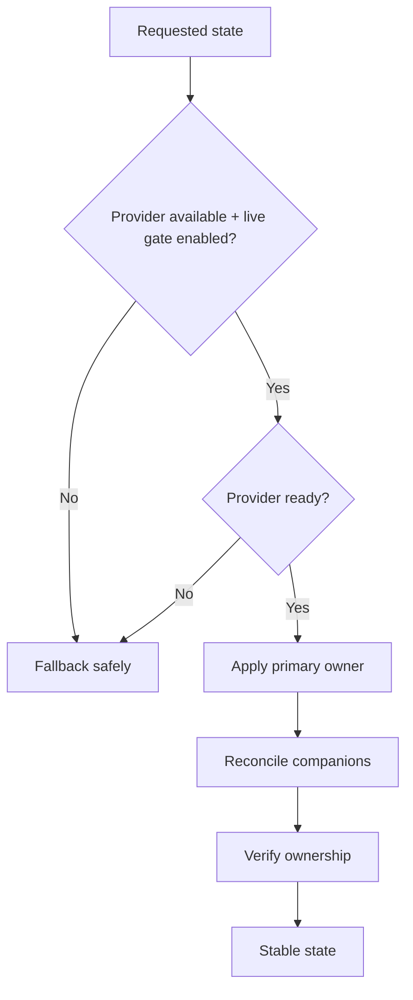
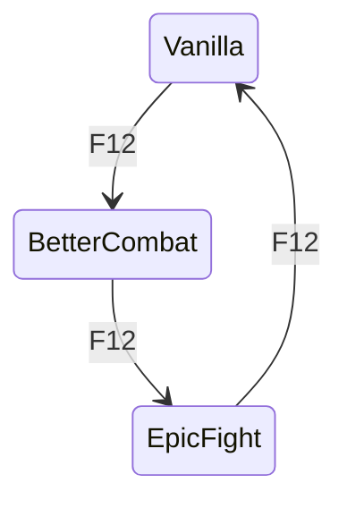
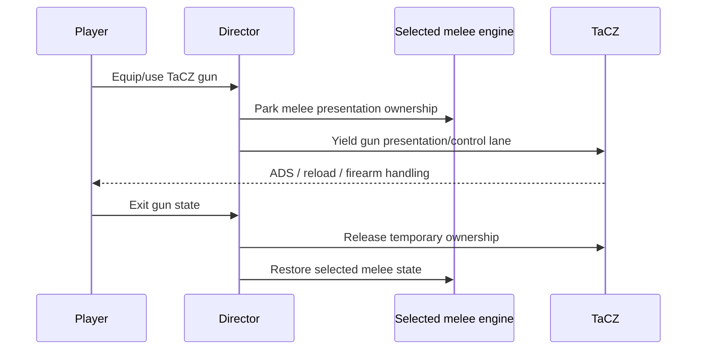

# 🔀 Combat Routing

RC16 is built around an **ownership state machine** rather than a pile of independent toggles.

## Two separate questions

Every transition answers these in order:

1. **Which primary combat engine owns normal melee/basic attack?**
2. **Which presentation companions are allowed to remain visible with that owner?**

That prevents a common compatibility mistake: treating “mod installed” as equivalent to “mod should currently own input/rendering.”

---

## Primary ownership

### Vanilla owner

- Better Combat primary attack ownership yields.
- Epic Fight primary battle ownership yields.
- Minecraft's normal attack/use lane remains authoritative.
- Punchy may accompany Vanilla only if Punchy master and the Vanilla pairing permission are both enabled.

### Better Combat owner

- Better Combat must be available and safely ready.
- Epic Fight basic attack authority yields.
- Punchy may accompany Better Combat only if explicitly permitted.
- First-person ownership is reconciled so Better Combat does not draw extra hands when another presentation provider owns that view.

### Epic Fight owner

- Epic Fight must be available and live-enabled.
- Better Combat basic attack authority yields.
- Punchy may accompany Epic Fight only if explicitly permitted.
- Advanced Epic Systems fusion remains a separate deliberate layer rather than an accidental side effect of selecting Epic Fight.

---

## F12 is intentionally simple

F12 does **not** include Smart Hybrid. The quick cycle is designed for muscle memory and predictable ownership.

---

## Provider loss and fallback

When `fallbackWhenUnavailable=true`—the RC16 default—the Suite avoids parking the player in a dead or half-owned state if a requested provider is absent or not ready.

Examples:

- Better Combat selected but not installed → fall back rather than pretending it owns attacks.
- Better Combat selected before its normal multiplayer readiness has been observed → do not unsafe-force it.
- Epic Fight gate switched OFF while Epic Fight is primary → immediately move primary ownership out of Epic Fight.
- YSM switched OFF → presentation is suppressed without changing the selected melee engine.

---

## TaCZ preemption

TaCZ is treated differently because gun handling is temporary and specialized.

The selected melee engine remains a preference; TaCZ is a temporary takeover, not a permanent mode rewrite.

---

## Why RC16 clears accidental fusion during quick selection

An earlier design could leave Epic Systems fusion active while switching primary engines. RC16 makes the normal quick selector unambiguous by clearing hidden fusion when a direct Vanilla/Better Combat/Epic Fight profile is selected.

If you want the optional fusion layer afterward, turn it back on deliberately with its advanced control.

This avoids a configuration that visually looks like “Better Combat” while an Epic-specific attack/presentation layer remains silently attached.

---

## Ownership verification

With ownership verification enabled, RC16 checks that the resulting state matches the requested authority model rather than assuming a reflective/config write succeeded.

That is a correctness feature, not a polling feature. The goal is to verify transitions when they happen—not to continuously hammer providers while the state is stable.

---

## Why this matches the compatibility research

Better Combat's own integration guidance warns integrators to remove or disable overlapping semantics such as attack input, timing/range/cooldown, dual-wield behavior, and conflicting model/animation presentation rather than trying to run both implementations simultaneously.

The compatibility projects studied around Epic Fight, Punchy, YSM and TaCZ likewise tend to solve conflicts by **yielding one presentation/combat system when another becomes authoritative**.

RC16 generalizes that pattern into one explicit arbiter instead of writing a separate ad-hoc patch for every pair.
