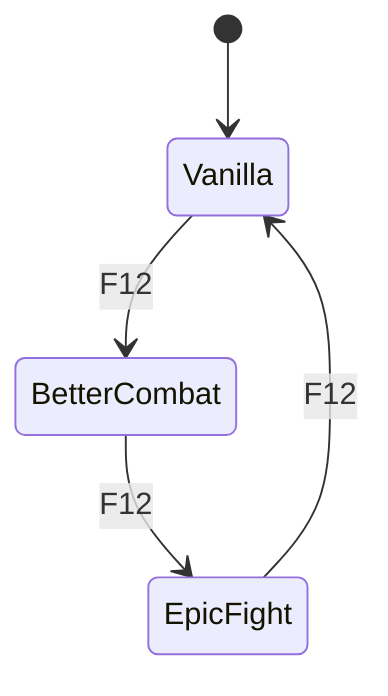

# 🚀 Getting Started

This page is the recommended **RC16 “install it once and play” path**.

## Requirements

- Minecraft **1.20.1**
- Forge **47.x** (RC16 development/verification target: Forge 47.4.x)
- Java **17**
- Combat Style Suite's two JARs:
  - `combat-style-director-5.0.0.jar`
  - `punchy-style-compat-5.0.0.jar`
- Install whichever upstream providers you actually want to use: Better Combat, Epic Fight, YSM, Punchy and/or TaCZ.

The Suite is an integration layer; it does not redistribute those upstream mods.

---

## Clean install order

1. Close Minecraft.
2. Remove older **Combat Style Director** and **Punchy Style Compat** JARs from `mods/`.
3. Keep only one copy of each RC16 Suite JAR.
4. Install/update your normal provider mods.
5. Put both RC16 Suite JARs in `mods/`.
6. Launch Minecraft normally and let Better Combat complete its normal server/client handshake.
7. Enter a world.
8. Use **F12** to test the live primary-engine cycle.

> Do not keep RC15/RC14 Suite JARs beside RC16. Duplicate Suite versions can make a correct ownership fix look broken.

---

## First five-minute test

### 1. Vanilla

Start in Vanilla. Swing and use an item in both hands. There should be one coherent first-person owner.

### 2. Better Combat

Press **F12** once. Better Combat should become the primary melee engine without restarting.

Test:
- empty hand;
- sword/tool;
- block/entity target;
- right-click food/shield/bow or another use-item;
- main hand and offhand.

### 3. Epic Fight

Press **F12** again. Epic Fight becomes the primary melee engine. Better Combat should yield.

### 4. Back to Vanilla

Press **F12** again. Both external primary melee engines should yield and Vanilla should own the basic attack lane.

---

## Add Punchy only if you want it

Punchy master is **OFF by default**. The three pairing permissions are ready by default, but do nothing until Punchy master is enabled.

When Punchy is enabled you can independently allow:

- Punchy + Vanilla
- Punchy + Better Combat
- Punchy + Epic Fight

This is intentional: Punchy is treated as a **presentation companion**, while the selected primary engine still owns basic combat semantics.

---

## YSM

YSM defaults to **Auto** presentation behavior. The Suite can live-disable YSM integration and re-enable/reconcile it without restarting.

YSM is not supposed to decide which melee engine owns left click. It is a presentation/model layer that must yield when an external renderer requires exclusive ownership.

---

## TaCZ

TaCZ gun handling is automatic when its integration gate is enabled. A TaCZ gun can temporarily take presentation/control ownership so ADS, reload and gun handling are not forced through a melee animation state.

When the gun state ends, the Suite restores the selected melee setup instead of permanently changing your configured combat mode.

---

## Settings I recommend leaving alone initially

| Setting | Recommendation |
|---|---|
| Startup engine | **Vanilla** |
| Smart Hybrid | **Leave OFF** |
| Better Combat unsafe force-enable | **Leave OFF** |
| Ownership verification | **Leave ON** |
| Fallback when unavailable | **Leave ON** |
| Punchy master | Personal preference; OFF is safest first boot |
| Provider gates | Leave ON for mods you installed |
| Pure Standby | Leave OFF unless you specifically want Suite hooks omitted next launch |

---

## If something looks wrong

Do not immediately start changing every compatibility option. First check:

1. only one version of each Suite JAR is installed;
2. the exact upstream mod versions match your pack;
3. the wrong provider is not manually forcing its own mode outside the Suite;
4. the issue reproduces in Vanilla, Better Combat, or Epic Fight individually;
5. whether it is an **attack ownership**, **first-person render**, **third-person model**, or **gun handling** problem.

That distinction usually identifies the correct owner to fix without reworking the whole compatibility system.

Next: **[What It Does](What-It-Does)** or **[Troubleshooting](Troubleshooting)**.
