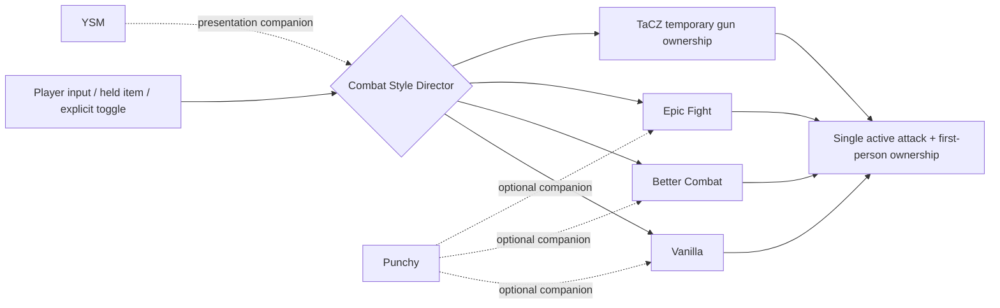

# ⚔️ Combat Style Suite 5.0.0 — RC16

> **One Minecraft instance. Multiple combat ecosystems. One owner at a time.**
>
> Combat Style Suite is a Forge 1.20.1 compatibility and routing layer for **Vanilla**, **Better Combat**, **Epic Fight**, **Yes Steve Model (YSM)**, **Punchy**, and **TaCZ**. Its job is not to replace those mods. Its job is to make them coexist predictably, switch cleanly while the game is running, and stay out of the way when nothing is changing.

---

## What RC16 is trying to solve

Large animation/combat packs tend to fail in the same places:

- two combat mods both think they own the left click;
- two first-person renderers both draw hands or weapons;
- an animation mod keeps rendering after another system takes ownership;
- a gun mod enters ADS/reload while a melee animation system is still forcing battle poses;
- a compatibility bridge polls every tick even when no state changed;
- switching combat systems requires restarting Minecraft;
- disabling an integration only disables the bridge UI while the provider still behaves as active.

RC16 treats those as **ownership problems**, not as reasons to continuously patch every frame.

The central rule is simple:

> **Basic attack authority and first-person ownership must be exclusive unless an advanced feature explicitly opts into a safe fusion.**

---

## The normal “just works” path

For normal play, RC16 is deliberately boring:

1. Start in **Vanilla** combat.
2. Press **F12** to cycle **Vanilla → Better Combat → Epic Fight → Vanilla** live.
3. Keep YSM available if you want custom player models.
4. Turn Punchy on only if you want its first-person presentation, then choose which primary engines are allowed to pair with it.
5. Let TaCZ temporarily take gun ownership when a TaCZ gun is actually in use.
6. Do nothing else unless you want advanced rules.

No restart is required for the normal provider toggles or F12 switching.

---

## RC16 live controls

| Control | Purpose | Restart? |
|---|---|---:|
| **F12** | Cycle Vanilla / Better Combat / Epic Fight | No |
| **F6** | Optional Epic Systems fusion layer | No |
| **F7** | YSM presentation toggle | No |
| **F8** | Punchy master toggle | No |
| **F9** | Broader attack-engine cycle including advanced modes | No |
| **F10** | Open Combat Style Composer | No |
| Provider config toggles | Hard live gate Epic Fight / Better Combat / YSM | No |
| Punchy pairing matrix | Allow Punchy with Vanilla / Better Combat / Epic Fight independently | No |
| **Pure Standby** | Physically omit Suite hooks on next launch | **Yes** |

---

## What “provider OFF” means in RC16

RC16 intentionally strengthened the meaning of OFF.

- **Epic Fight OFF**: Suite immediately removes Epic Fight from current routing and prevents its normal transitions from bypassing the gate.
- **Better Combat OFF**: Suite immediately removes Better Combat attack ownership. A later Better Combat handshake is remembered safely but does not silently reactivate it while the gate is off.
- **YSM OFF**: Suite hides/disengages the YSM self-model and guards against an external config/state event re-showing it until you explicitly turn YSM back on.
- **Punchy OFF**: Punchy companion presentation is not selected by Suite.
- **TaCZ gate OFF**: Suite stops its TaCZ-specific ownership routing.

Turning a live provider gate back on reconciles the current selected setup without requiring a Minecraft restart.

---

## Punchy is a companion, not another primary engine

RC16 separates **“which combat engine owns the attack?”** from **“may Punchy provide its presentation here?”**

The Punchy matrix contains three independent permissions:

- Punchy + Vanilla
- Punchy + Better Combat
- Punchy + Epic Fight

That lets you keep one primary combat authority while deciding exactly where Punchy's first-person style is welcome.

See **[Punchy Pairing Matrix](Punchy-Pairing-Matrix)**.

---

## Performance philosophy

The Suite is designed around **transitions**, not perpetual enforcement.

Normal routing does **not** rely on:

- a server watchdog;
- a heartbeat loop;
- a recurring Forge client/server tick listener for primary routing;
- held-item polling every tick;
- keybind polling every tick;
- stale-player scans;
- continuous provider reflection when state is unchanged.

State is cached and recomputed when a meaningful input changes.

There is one intentionally narrow exception: an **advanced NBT-sensitive Smart Hybrid/capability rule** can arm a client-only freshness sampler at approximately one-second resolution because another mod may mutate the same held `ItemStack`'s NBT in place without replacing the item or firing a universal Minecraft transition event. **Smart Hybrid is OFF by default**, so normal F12/provider/Punchy/TaCZ use does not need that fallback.

See **[Performance & No-Lag Design](Performance-and-No-Lag-Design)**.

---

## Default philosophy

RC16 defaults favor predictable behavior:

| Setting | RC16 default | Why |
|---|---:|---|
| Primary engine | **Vanilla** | Safest startup owner |
| Smart Hybrid | **Off / not selected** | No automatic capability routing unless requested |
| YSM layer | **Auto** | Available without forcing it into every state |
| Punchy master | **Off** | Avoid surprise first-person ownership |
| Punchy + Vanilla permission | On | Ready when Punchy master is enabled |
| Punchy + Better Combat permission | On | Ready when Punchy master is enabled |
| Punchy + Epic Fight permission | On | Ready when Punchy master is enabled |
| Provider integration gates | On | Integrations are available, not constantly polling |
| Unsafe Better Combat force-enable | **Off** | Respect normal client/server handshake |
| Ownership verification | On | Fail safe instead of allowing ambiguous ownership |
| Fallback when provider unavailable | On | Avoid dead combat states |
| Pure Standby | Off | Normal Suite functionality available |

---

## Research-backed design

RC16 was compared against public compatibility approaches around Better Combat, Epic Fight, YSM, Punchy, and TaCZ. The important takeaway is not that every bridge uses the same API—it does not. The recurring successful patterns are:

1. **remove semantic overlap instead of letting two systems fight;**
2. **explicitly transfer render/input authority;**
3. **respect Better Combat's server/client synchronization rather than force-enable it prematurely;**
4. **yield melee animation ownership for gun/ADS/reload states;**
5. **avoid doing full-registry or expensive capability work every frame;**
6. **treat model compatibility and combat ownership as separate layers.**

The full audit, including source-reviewed projects and closed-source project-page references, is in **[Compatibility Research](Compatibility-Research)**.

---

## Where to go next

- **[Getting Started](Getting-Started)** — install order and the first five minutes.
- **[What It Does](What-It-Does)** — feature-by-feature explanation.
- **[Combat Routing](Combat-Routing)** — ownership state machine.
- **[Provider Toggles](Provider-Toggles)** — what OFF/ON actually changes.
- **[Punchy Pairing Matrix](Punchy-Pairing-Matrix)** — all Punchy combinations.
- **[TaCZ & First-Person Ownership](TaCZ-and-First-Person-Ownership)** — gun takeover and the single-arm rule.
- **[Smart Hybrid & Rules](Smart-Hybrid-and-Rules)** — advanced automatic routing.
- **[Configuration Reference](Configuration-Reference)** — defaults and recommendations.
- **[Performance & No-Lag Design](Performance-and-No-Lag-Design)** — hot-path audit.
- **[Compatibility Matrix](Compatibility-Matrix)** — what is supported together.
- **[Compatibility Research](Compatibility-Research)** — comparable mods studied.
- **[Testing & Verification](Testing-and-Verification)** — what RC16 has actually proven.
- **[Things You May Want to Change](Things-You-May-Want-to-Change)** — deliberate design decisions to review before changing code.
- **[References](References)** — upstream projects and evidence links.

---

> **Current recommendation:** keep RC16's core routing model frozen unless an actual in-game reproducer proves a native-only conflict. The compatibility survey supports the architecture; future changes should be narrow additions, not another ownership rewrite.
