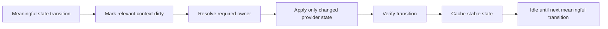

# 🏎️ Performance & No-Lag Design

The performance goal for Combat Style Suite is unusual for a compatibility mod:

> **When nothing relevant changes, the Suite should have almost nothing useful to do.**

RC16 is therefore designed around event/transition reconciliation and cached rule results rather than constant enforcement.

---

## What is deliberately absent from normal primary routing

RC16's normal Vanilla / Better Combat / Epic Fight routing does not need:

- a server watchdog;
- a heartbeat packet;
- a recurring Forge client tick listener to re-select the primary engine;
- a recurring Forge server tick listener to enforce player mode;
- per-tick held-item rescans for normal F12 mode;
- per-tick keybind polling;
- stale-player cleanup scans every tick;
- repeated provider reflection when the requested state is unchanged;
- a background full-registry weapon crawler.

---

## Transition-driven model



Meaningful transitions include things such as:

- pressing a live mode/toggle control;
- provider readiness/handshake;
- relevant held-item/context change when advanced rules are active;
- connection/world lifecycle changes;
- entering/exiting a TaCZ gun state;
- changing a rule/config that invalidates the cached decision.

---

## Cached rule evaluation

The combat rule engine keeps enough context to avoid repeating work that cannot change the answer.

A rule set that does not use provider capability matching should not need provider capability probes.

A rule set that does not care about held item identity should not need item inspection just to return the same configured result.

A stable same-stack/same-input/same-network state can reuse the cached route until a relevant invalidation occurs.

---

## Provider integration gates are not background workers

All provider gates default ON so installed integrations are available, but that does **not** mean five provider scanners are running all the time.

The design distinction is:

```text
integration gate ON  = this provider may participate when needed
provider currently owner = this provider actually owns the active lane
```

Those are not the same state.

---

## Multiplayer network design

Multiplayer presentation sync should send meaningful state transitions, not continuous reassurance packets.

The Suite's regression harness includes burst/coalescing behavior so rapid local transitions do not intentionally become one server packet per tiny intermediate presentation state.

This is particularly important for large modpacks where the compatibility layer must not add an avoidable server-side tax simply because many clients are connected.

---

## The only narrow recurring freshness fallback

An advanced Smart Hybrid/capability rule can depend on compatibility-relevant NBT inside the currently held `ItemStack`.

Another mod may mutate that NBT **in place** without replacing the held stack. There is no universal Forge event that reports every arbitrary third-party in-place NBT mutation.

When such a rule genuinely needs it, RC16 can arm a **client-only low-frequency freshness sampler**, roughly once per second.

### It does not arm for normal use

The sampler is not needed merely because you have:

- Better Combat installed;
- Epic Fight installed;
- YSM installed;
- Punchy installed;
- TaCZ installed;
- F12 switching enabled;
- live provider gates enabled;
- Punchy pairings enabled.

Smart Hybrid is not selected by default.

### Why one second

The fallback is about eventual correctness for unusual in-place metadata mutations, not frame-perfect animation timing. A low frequency avoids turning a rare compatibility edge into a hot path.

---

## Pure Standby

For users who want the strongest possible dormant state, Pure Standby can omit Suite runtime hooks on the next launch.

This is stronger than necessary for normal performance, which is why it is opt-in. Runtime live gates already avoid provider-specific work when a provider is disabled.

---

## Compatibility research: performance lessons

The external compatibility survey produced several useful lessons:

### Better Combat

Better Combat itself relies on explicit weapon attributes/configuration and multiplayer synchronization. Integrators are expected to remove overlapping semantics rather than continuously correct two fighting systems.

That supports RC16's single-owner state machine.

### Better Combat × Epic Fight bridges

At least one bridge in this space has publicly discussed moving broad weapon registration away from a large join-time spike and spreading work to reduce hitching. The lesson for RC16 is not “copy that loop”; it is **avoid a monolithic automatic registry workload unless the feature truly needs one**.

### Epic Fight × TaCZ

The public `Ardelhite/epic-tacz` implementation uses a client-tick path for its narrow pairwise ownership behavior. That proves one viable solution, but RC16's broader router should not generalize a pairwise tick approach into a five-provider global enforcement loop.

---

## What would count as a performance regression

Any future change should be challenged if it introduces one of these without strong evidence:

- scan all registered weapons on every login;
- scan all players every tick;
- reflect into all optional providers every frame;
- resend unchanged presentation state repeatedly;
- reapply the same provider flags every tick;
- perform NBT/capability probes when no enabled rule needs them;
- add a scheduled background repair/watchdog process;
- retain references to disconnected players without lifecycle cleanup.

---

## Recommended performance acceptance test

For a future RC, test at least:

1. idle in a world with all five providers installed;
2. verify no Suite-originating repeating network spam while state is unchanged;
3. switch F12 modes repeatedly and confirm only transition work occurs;
4. toggle YSM/Punchy/providers repeatedly;
5. enter/exit TaCZ state;
6. test Smart Hybrid disabled—no NBT sampler path should be armed;
7. enable an NBT-sensitive rule and prove the sampler is low-frequency/client-only;
8. verify no server tick listener was added for primary routing;
9. profile only if a native pack shows a measurable regression.

---

## Current recommendation

Do **not** add more automatic background compatibility discovery to RC16 merely to make the mod look smarter.

The current architecture already supports the important QOL behavior—live switching, live provider gates, Punchy pairings and TaCZ takeover—without needing a global polling loop.

Future performance changes should be driven by a measured native bottleneck or a concrete compatibility reproducer, not by speculative micro-optimization.
