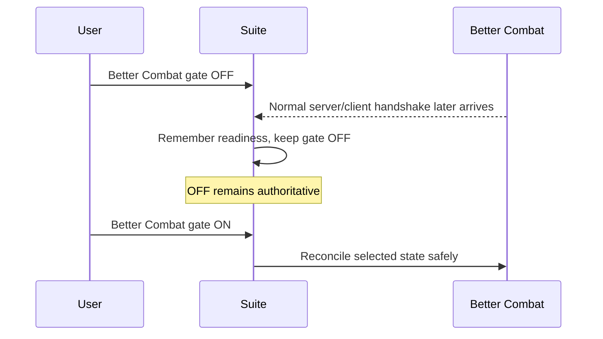

# 🎚️ Provider Toggles

Provider gates are RC16's answer to **“I installed this mod, but I want Combat Style Suite to stop using it right now.”**

They are separate from the selected combat mode.

---

## Live gate matrix

| Provider | Gate OFF does this immediately | Gate ON does this | Restart? |
|---|---|---|---:|
| **Epic Fight** | Removes Epic Fight from Suite routing and guards against Epic transitions bypassing the OFF state | Reconciles Epic availability with the currently selected setup | No |
| **Better Combat** | Removes Better Combat attack ownership; later handshake cannot silently reactivate it | Uses remembered readiness/handshake state and reconciles safely | No |
| **YSM** | Hides/disengages the YSM self-model through Suite ownership and guards against external state re-showing it | Restores/reconciles the intended YSM presentation state | No |
| **Punchy** | Removes Punchy companion presentation | Re-enables Punchy subject to the pairing matrix | No |
| **TaCZ** | Stops Suite's TaCZ-specific ownership handling | Allows automatic gun takeover/restore behavior | No |

---

## Better Combat: why OFF and “not ready yet” are different

Better Combat is multiplayer-aware. RC16 tracks a readiness/handshake boundary so the Suite does not claim Better Combat is safely active before the normal provider/server relationship has happened.

Consider this sequence:

This is important: **readiness information may update while a provider is disabled without changing the user's disabled choice.**

The default `allowUnsafeBetterCombatForceEnable=false` should remain false unless there is a proven upstream-specific reason to change it.

---

## Epic Fight gate

Epic Fight OFF means the Suite will not keep Epic Fight as the primary selected combat authority.

The gate also guards normal provider transitions from simply reasserting the state behind the Suite's back. When enabled again, RC16 reconciles based on the current selected setup rather than requiring Minecraft to restart.

### Epic Systems fusion is separate

The advanced **Epic Systems** fusion layer is intentionally separate from the ordinary Epic Fight primary mode. Direct quick-profile selection clears accidental hidden fusion so “Better Combat” really means Better Combat is the primary route.

If you want fusion, enable it deliberately after the primary mode selection.

---

## YSM gate

YSM differs from Epic/Better Combat because it is primarily presentation/model ownership rather than normal basic-attack authority.

RC16's YSM OFF behavior is deliberately stronger than earlier versions:

- hide/disengage the self-model through the Suite;
- prevent an external YSM config/state write from immediately undoing the user's OFF choice;
- retain enough intent to restore the prior presentation when YSM is enabled again.

This avoids the frustrating version of a toggle where the UI says OFF but a later provider event makes the model reappear.

---

## Punchy gate vs Punchy pairings

Punchy has **two levels**:

1. Punchy master/provider gate.
2. Pairing permission for the currently selected primary engine.

Punchy renders only when both permit it.

Example:

| Punchy master | Punchy + Better permission | Primary engine | Result |
|---:|---:|---|---|
| Off | On | Better Combat | Punchy suppressed |
| On | Off | Better Combat | Punchy suppressed |
| On | On | Better Combat | Punchy allowed |

See **[Punchy Pairing Matrix](Punchy-Pairing-Matrix)**.

---

## Pure Standby is not another provider toggle

Provider gates are **live runtime choices**.

Pure Standby is a **startup integration policy**. On the next launch, it can physically omit Suite runtime hooks for the strongest possible standby state. Since mixin/startup hook composition happens during launch, changing Pure Standby necessarily requires a restart.

Use provider gates for normal play. Use Pure Standby only when you intentionally want the Suite present for configuration but effectively absent from runtime integration on the next launch.

---

## Recommended defaults

- Keep integration gates ON for provider mods you actually installed.
- Use the live toggle when you want one disabled temporarily.
- Keep unsafe Better Combat force-enable OFF.
- Keep ownership verification ON.
- Leave Pure Standby OFF for normal use.

Having a provider gate ON does **not** mean the Suite is continuously polling that provider. It means that provider is eligible to participate when a meaningful transition requires it.
