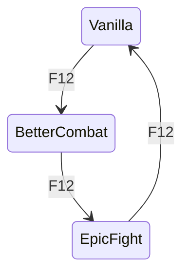

# 👊 Punchy Pairing Matrix

Punchy compatibility was separated from primary combat selection in RC16 on purpose.

> **Punchy may provide compatible presentation; it does not become a second independent basic-attack authority.**

---

## The four controls

1. **Punchy master**
2. **Punchy + Vanilla**
3. **Punchy + Better Combat**
4. **Punchy + Epic Fight**

RC16 defaults:

- Punchy master: **OFF**
- Punchy + Vanilla: **ON**
- Punchy + Better Combat: **ON**
- Punchy + Epic Fight: **ON**

That means the Suite is ready for all three pairings but will not suddenly introduce Punchy into a fresh install until you explicitly enable the Punchy master.

---

## Complete normal matrix

| Primary engine | Punchy master | Matching pairing permission | Punchy result |
|---|---:|---:|---|
| Vanilla | Off | Any | Suppressed |
| Vanilla | On | Off | Suppressed |
| Vanilla | On | On | Allowed |
| Better Combat | Off | Any | Suppressed |
| Better Combat | On | Off | Suppressed |
| Better Combat | On | On | Allowed |
| Epic Fight | Off | Any | Suppressed |
| Epic Fight | On | Off | Suppressed |
| Epic Fight | On | On | Allowed |

The unused pairing permissions are ignored. For example, `Punchy + Epic Fight = On` does nothing while Better Combat is the primary engine.

---

## Why this is better than three “combined modes”

A tempting design would create separate primary presets such as:

- Vanilla + Punchy
- Better Combat + Punchy
- Epic Fight + Punchy
- Vanilla without Punchy
- Better without Punchy
- Epic without Punchy

That quickly doubles the state space and makes hot switching harder to reason about.

RC16 instead stores:

```text
primary combat owner = Vanilla | Better Combat | Epic Fight
Punchy master        = On | Off
pairing permission   = per-primary-engine boolean
```

That keeps attack authority orthogonal to presentation preference.

---

## F12 behavior with Punchy

F12 still does exactly one thing:



After the primary owner changes, the Suite asks whether Punchy is allowed with the new owner and reconciles presentation.

Example:

```text
Punchy master: ON
Punchy + Vanilla: ON
Punchy + Better: OFF
Punchy + Epic: ON
```

Then F12 produces:

```text
Vanilla       -> Punchy visible/allowed
Better Combat -> Punchy yields
Epic Fight    -> Punchy visible/allowed
Vanilla       -> Punchy visible/allowed
```

No restart is needed.

---

## What the comparable Punchy bridges taught us

The compatibility projects reviewed around Punchy generally solve conflicts by conditionally suppressing Punchy's rendering while another combat/animation system owns the relevant state.

Examples studied include:

- **Epic Fight & Better Combat x Punchy!** — a Forge 1.20.1 bridge whose project description explicitly describes suppressing Punchy presentation when Epic Fight battle state / Better Combat swinging needs ownership.
- **Tijōn's Epic Punchy** — an Epic Fight/Punchy-focused compatibility project describing intelligent presentation switching and firearm-aware behavior.

Those projects reinforce the same design idea: **Punchy should yield contextually rather than compete blindly for first-person rendering.**

RC16 extends that idea into a user-controlled matrix instead of hardcoding one universal relationship.

---

## Recommended setup

For the most “QOL it just works” experience:

1. Keep all three pairing permissions ON.
2. Toggle Punchy master ON only if you want Punchy's presentation.
3. If one engine has a native visual conflict in your specific pack, turn OFF only that one pairing.

This makes the narrowest possible change and preserves the other two working combinations.

---

## Troubleshooting duplicate hands

If Punchy is involved in a duplicate first-person arm/weapon issue:

1. turn Punchy master OFF live;
2. reproduce with the same primary engine;
3. if the duplicate disappears, enable Punchy master but disable only that engine's pairing;
4. capture the exact item/use action causing the conflict.

Do **not** immediately disable Better Combat's global arm rendering or rewrite all primary routing. RC16 already contains the RC14 single-arm ownership fix; a remaining native-only Punchy conflict should be fixed at the narrow Punchy ownership boundary.
