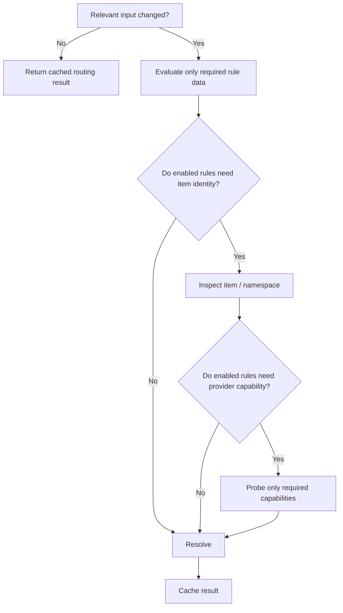

# 🧠 Smart Hybrid & Combat Rules

Smart Hybrid is the **advanced automatic-routing layer**. It is not part of the normal F12 quick cycle and is **not selected by default**.

If you only want live manual Vanilla / Better Combat / Epic Fight switching, you can ignore this entire page.

---

## What Smart Hybrid is for

Some modpacks contain weapons where one combat engine clearly owns a better integration than another. Smart Hybrid can classify the held item and choose an engine according to that capability state.

Typical classes include:

- Epic Fight-capable;
- Better Combat-capable;
- compatible with both;
- unclaimed / tool / empty;
- exact item/namespace matches from user rules.

The intent is **deterministic routing**, not “AI combat guessing.”

---

## Why it is OFF by default

Automatic routing adds complexity that most players do not need.

RC16's safe everyday default is:

```text
startup primary engine = Vanilla
F12 = Vanilla → Better Combat → Epic Fight → Vanilla
Smart Hybrid = not selected
```

That means:

- no surprise engine switching when you equip a weapon;
- no need for capability probes during ordinary manual play;
- no need for the advanced NBT freshness fallback;
- easier debugging if a third-party weapon has unusual metadata.

---

## Rule matching

The rule engine can use narrow match strategies such as:

### Exact item

Example concept:

```text
minecraft:diamond_sword → Better Combat
```

### Namespace / mod ID

Example concept:

```text
cataclysm:* → Epic Fight
```

### Capability / ownership

Example concept:

```text
if Epic-compatible only → Epic Fight
if Better-compatible only → Better Combat
if both → configured preference
```

### Any / fallback

A final rule can provide a safe catch-all rather than leaving the player in an undefined state.

---

## Cached evaluation

The rule engine is designed to avoid doing expensive work when inputs have not changed.

Conceptually:



A rule set that only cares about an exact item should not force every compatibility provider to be reflected/probed on every frame.

---

## The one-second NBT-sensitive fallback

This is the small recurring fallback discussed in the main wiki.

### Why it exists

Forge gives useful events when the player changes held stacks, slots, connections and many other states. But another mod can legally mutate **NBT inside the same existing `ItemStack` object** without replacing the stack.

There is no one universal Forge event that means:

> “some third-party mod just changed compatibility-relevant NBT inside the already-held stack.”

If a Smart Hybrid/capability rule actually depends on that mutable NBT, RC16 can arm a client-only low-frequency freshness check (approximately once per second) so routing does not stay stale forever.

### What it does not do

It is **not**:

- a server poller;
- a per-tick loop;
- active during normal F12 switching;
- active merely because Better Combat/Epic Fight/YSM/Punchy/TaCZ are installed;
- required for exact-item or namespace rules that do not depend on in-place capability NBT changes.

### Recommendation

**Leave Smart Hybrid off unless you have a real weapon-routing use case.**

If you do use it, keep rules as narrow as practical so capability probing is only armed where it provides value.

---

## Hybrid preference

When an item is valid for both Better Combat and Epic Fight, RC16 has a configured preference rather than allowing both systems to own basic attack simultaneously.

Current default preference: **Epic Fight**.

That preference is only relevant when the advanced hybrid path is selected; it does not change the normal F12 cycle.

---

## Why RC16 does not auto-scan every weapon registry

Some compatibility bridges build broad weapon registries automatically. That can be useful, but doing a full registry walk at login/join or continuously is exactly the kind of work that can create pack-scale stutter if done carelessly.

The compatibility survey found examples of bridges moving registry-registration work away from one large join spike and distributing it to reduce hitching. RC16 takes the more conservative route for its own job:

- reuse upstream Better Combat attributes/config where possible;
- classify only what an enabled rule actually needs;
- cache stable results;
- avoid a background “discover everything forever” worker.

For a QOL compatibility layer, **less hidden automation is usually safer than a giant automatic registry mirror**.

---

## When I would actually enable Smart Hybrid

Use it when:

- a modpack contains large weapon families with clearly different engine compatibility;
- manually pressing F12 every weapon swap is annoying;
- the rules are stable and testable;
- you want exact item/namespace ownership policy.

Do not enable it merely because it sounds more advanced.

The normal manual selector is simpler, cheaper and easier to trust.
