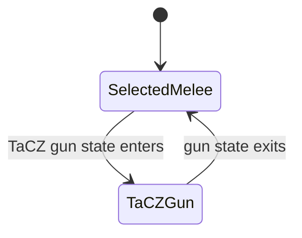

# 🔫 TaCZ & First-Person Ownership

TaCZ is where “just let every animation mod run” breaks down fastest. Firearms have ADS, reload, inspect, recoil and weapon-specific presentation that a melee system cannot safely own at the same time.

RC16 therefore treats TaCZ as a **temporary specialist owner**.

---

## Intended ownership lifecycle



The selected melee engine is parked, not forgotten.

When TaCZ no longer needs the specialist lane, RC16 restores the previously selected Vanilla / Better Combat / Epic Fight state.

---

## Why this matters

Without explicit transfer, common conflicts include:

- Epic Fight battle pose overriding gun stance;
- first-person melee hands appearing during ADS;
- a compatibility renderer drawing a second weapon/arm;
- reload/inspect animation being replaced by a melee animation;
- a bridge permanently switching the player out of their selected melee mode instead of restoring it.

RC16's goal is not to animate TaCZ itself. It is to **get the other owners out of TaCZ's way** and then restore them afterward.

---

## The RC14+ single-arm rule

RC16 retains a specific first-person ownership repair introduced in RC14.

When another renderer owns first person and Better Combat must yield, the Suite temporarily suppresses both Better Combat first-person arm controls:

- the normal/primary first-person arms;
- Better Combat's “other hand” first-person lane.

The Suite stores the exact previous values and restores them when Better Combat is allowed to own first person again.

### Why both flags matter

Suppressing only the primary arm can still leave a duplicate arm on right-click/use-item because the provider's other-hand path remains enabled.

That is how you get the classic symptom:

```text
right click food / shield / bow / offhand item
          ↓
external renderer draws the intended hand
          +
Better Combat still draws the other-hand lane
          ↓
duplicate arm
```

RC16's ownership rule is:

> If an external first-person renderer owns the view, Better Combat must not independently draw either first-person hand lane through the compatibility fallback.

---

## Source-reviewed reference: Epic Fight × TaCZ compatibility

The public **Ardelhite/epic-tacz** project was inspected as a useful comparison:

- source: https://github.com/Ardelhite/epic-tacz
- it explicitly detects TaCZ gun use and makes Epic Fight yield battle-mode presentation while the gun is active;
- it restores the non-gun Epic state afterward;
- it includes a third-person animation integration path for TaCZ;
- newer project behavior describes preserving selected Epic Fight movement/dodge behavior while firearm ownership is active.

The key lesson is strong: **gun compatibility works best by transferring presentation authority, not by trying to make a melee pose and firearm pose win simultaneously.**

### Where RC16 intentionally differs

The reference bridge uses a client-tick detection path. Combat Style Suite's broader architecture prefers transition/cached reconciliation and avoids adding a general-purpose per-tick enforcement loop just because one pairwise bridge does so.

RC16 should only adopt a recurring detector where there is no reliable transition signal and the detector can be tightly scoped.

---

## Potential future TaCZ enhancement

One feature worth considering—but not worth changing blindly—is **Epic Fight dodge/movement retention while a TaCZ gun temporarily suppresses battle presentation**.

That should be treated as a separate capability from basic melee ownership:

```text
Epic Fight primary melee battle presentation: yielded to gun
Epic Fight optional movement/dodge capability: potentially retained
TaCZ firearm animation/ADS/reload: authoritative
```

I would only add this after a native test proves exactly which Epic movement capabilities can remain active without reintroducing pose, hand or input ownership conflicts.

---

## Native test checklist

When testing the final five-provider stack, use at least:

- TaCZ pistol/rifle if available;
- hip fire;
- ADS;
- reload;
- inspect/alternate animation if supported;
- switch gun → sword → gun;
- F12 change before and after a gun state;
- Punchy master ON/OFF;
- YSM ON/OFF;
- main hand + offhand item use;
- first person and third person.

The pass condition is not “nothing crashed.” It is:

> exactly one appropriate renderer owns each presentation lane, gun handling is not damaged, and the selected melee state returns after firearm ownership ends.
