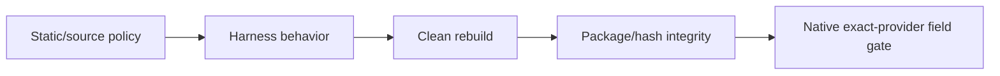

# ✅ Testing & Verification

This page separates **what RC16 has actually proven** from **what still requires the final real five-provider Minecraft field test**.

## Verification philosophy

A successful Java compile is not enough for a combat/render compatibility mod.

RC16 testing is layered:

The first four layers are strong deterministic evidence. The fifth is still required for claims that only a real rendered Minecraft client with the exact upstream binaries can prove.

---

## RC16 targeted behavior harness — PASS

The RC16 Director harness verifies the requested live behavior, including:

- Vanilla / Better Combat / Epic Fight live selection;
- F12 round trip without restart;
- Epic Fight provider OFF → stays suppressed → ON reconciles;
- Better Combat OFF → handshake arrives while OFF → stays OFF → ON reconciles safely;
- YSM OFF → external/config state attempts to re-enable presentation → stays OFF → ON restores;
- Punchy master and pairing permissions across Vanilla / Better Combat / Epic Fight;
- YSM and Punchy state preservation where intended;
- direct quick selection clearing accidental hidden Epic Systems fusion;
- TaCZ/visual/controller prior regression coverage.

---

## RC14 single-arm regression — PASS

The exact right-click/use-item ownership regression remains covered.

The harness exercises external first-person ownership cases and verifies that Better Combat's compatibility fallback suppresses both relevant first-person hand lanes while yielding, then restores the exact previous values afterward.

This is the regression that guards against “extra arms popping out when left/right clicking.”

---

## Better Combat old/new integration routes — PASS

Regression coverage includes:

- older Better Combat layout/route behavior;
- newer/native route behavior;
- exact restoration/snapshot logic;
- ownership transitions.

This helps prevent a compatibility fix from only working against one reflected class/layout shape.

---

## Hard standby / integration policy — PASS

Static/behavior checks cover:

- live provider gates;
- startup hard-gate policy;
- Pure Standby behavior;
- optional-linkage boundaries;
- package integrity;
- no placeholder/stub production packaging;
- no task-related TODO/FIXME/HACK leakage in the release path.

---

## Performance/coalescing regression — PASS

The isolated multiplayer presentation coalescer was rerun across multiple fresh JVM invocations after one timing-sensitive runner failure and passed **5/5 fresh runs**.

The investigation did not justify weakening the coalescer or adding a server heartbeat.

---

## Clean-source reproducibility — PASS

The frozen RC16 source archive was extracted into a clean location and rebuilt independently.

The clean build reproduced the frozen candidate JAR bytes, providing strong evidence that the handed-off source corresponds to the distributed binaries rather than to an uncommitted working directory.

---

## Frozen RC16 hashes

| Artifact | SHA-256 |
|---|---|
| `combat-style-director-5.0.0.jar` | `ed71dcc66e2245a2b61b5c2d5c11090f83f1c31ff9509ebace63c895548149c6` |
| `punchy-style-compat-5.0.0.jar` | `02bd08e78718aab3787321cf5084ef0c43dcbe773f9a119b4010fe8bff04d8cd` |
| RC16 install bundle | `f59fa99a54c4e4c6fec545fcec41a2f96d840af9a4b55803af5c87d557fa6cb8` |
| RC16 source ZIP | `4de1877a1329bb096ea7bbe890c408e65648be5e76f92259feafc00acfa0804f` |

The repository's `dist/RC16-SHA256.txt` is the public hash manifest for the frozen release files.

---

## Packaging audit correction

During the GitHub/wiki audit, a packaging-state inconsistency was found:

- the **RC16 install bundle contained the correct RC16 JAR bytes**;
- two loose top-level working-copy JAR files had later been overwritten with older RC15/RC14 bytes.

Before GitHub publication, the loose JARs were restored **from the verified RC16 bundle** and rechecked against the frozen RC16 SHA-256 values above.

This did **not** require a combat-code change. It was a handoff/publication integrity correction.

The GitHub `dist/` artifacts are intended to be the corrected RC16 bytes above.

---

## Broad verifier result

The broad verifier reached the task-related behavior/static gates successfully. Its wrapper later hit the runner's time limit during a redundant final rebuild phase; there was no new assertion failure before that boundary.

A separate deterministic clean rebuild was used instead of repeatedly rerunning the same timed-out wrapper path.

---

# Remaining native field gate

The runner used for RC16 development did not have all five exact upstream provider JARs available together for a fresh real Forge client launch.

Therefore RC16 should **not** be described as freshly native-verified against the exact five-provider stack from this runner.

## Exact target stack for field QA

- Epic Fight `20.14.17-mc1.20.1-forge`
- Better Combat `1.9.0+1.20.1-forge`
- YSM `2.6.5-forge+mc1.20.1`
- Punchy `2.7d` Forge 1.20.1
- TaCZ `1.20.1-1.1.8-hotfix`

## Final field test

In the real pack:

1. remove older Suite JARs;
2. install only the frozen RC16 Director + Compat pair;
3. enter a world and let Better Combat complete normal readiness/handshake;
4. F12 Vanilla → Better Combat → Epic Fight → Vanilla;
5. left-click empty hand, weapon, block and mob;
6. right-click/use food, shield, bow and offhand cases;
7. toggle YSM live OFF/ON;
8. toggle Better Combat live OFF/ON;
9. toggle Epic Fight live OFF/ON;
10. test Punchy master with each pairing individually;
11. equip/use TaCZ guns, ADS/reload, then return to melee;
12. verify exactly one first-person ownership lane at a time;
13. inspect fresh log for task-related mixin/reflection/render errors.

If a native-only failure appears, preserve RC16 as the baseline and fix the **narrow failing ownership boundary** instead of reverting already-proven logic.

---

## Release status wording

Safe statement:

> RC16 is clean-build reproducible and behavior/static/package regression tested, including live provider toggles, Punchy pairings, Better Combat restoration and the single-arm right-click reproducer. Exact all-five-provider native Minecraft client QA remains the final field gate.

That is the evidence level the project should maintain until the real stack is exercised.
