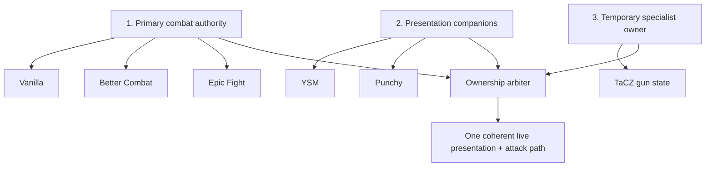
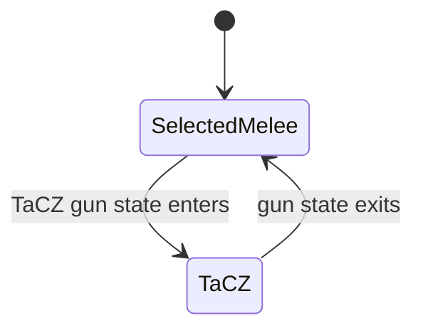

# 🧭 What It Does

Combat Style Suite is easiest to understand as **three cooperating layers**.

---

## 1. Primary combat engine selection

The primary engine answers the question:

> **Who owns normal melee/basic attack behavior right now?**

RC16 supports three normal live choices:

### Vanilla

Minecraft's normal attack/use behavior is the primary lane. Better Combat and Epic Fight are not allowed to remain simultaneous basic-attack authorities through the Suite.

### Better Combat

Better Combat owns its attack flow after its normal client/server readiness/handshake has been observed. RC16 does not intentionally bypass that safety boundary.

### Epic Fight

Epic Fight owns the primary melee lane. RC16 coordinates the other providers so Better Combat does not remain a competing basic-attack owner.

### F12 quick cycle

F12 intentionally cycles only these three normal engines:

`Vanilla → Better Combat → Epic Fight → Vanilla`

Smart Hybrid is not inserted into that everyday cycle. That is deliberate; automatic capability routing should be an explicit advanced choice rather than something you land on accidentally.

---

## 2. Live provider gates

A provider gate answers a different question:

> **May Combat Style Suite use and reconcile this provider at all?**

RC16 has live gates for:

- Better Combat
- Epic Fight
- YSM
- Punchy
- TaCZ

For the main three requested providers—Better Combat, Epic Fight and YSM—OFF is a hard live suppression state, not merely “stop showing a button.”

The Suite remembers enough state to reconcile the provider again when the gate is turned back on.

See **[Provider Toggles](Provider-Toggles)**.

---

## 3. Punchy pairing

Punchy is not treated as a fourth normal primary combat engine.

Instead RC16 exposes:

- Punchy master
- Punchy with Vanilla permission
- Punchy with Better Combat permission
- Punchy with Epic Fight permission

This design allows Punchy's first-person presentation without creating a second independent decision about basic-attack authority.

See **[Punchy Pairing Matrix](Punchy-Pairing-Matrix)**.

---

## 4. YSM model/presentation compatibility

YSM is treated primarily as a model/render/animation presentation provider.

The Suite's responsibilities include:

- allowing normal YSM presentation where safe;
- live hiding/disengaging it when its provider gate is disabled;
- preventing a later YSM state/config event from bypassing an intentional Suite OFF state;
- restoring/reconciling prior intended presentation when YSM is enabled again;
- yielding correctly when another renderer needs exclusive ownership.

It does **not** make YSM the owner of basic attack semantics.

---

## 5. Better Combat handshake safety

Better Combat has multiplayer-aware synchronized configuration and weapon behavior. A compatibility layer that simply reflectively flips a local flag before the server/client relationship is ready can create a misleading state: UI says Better Combat is on, but the provider has not completed the state it expects.

RC16 therefore keeps an observed-handshake/readiness latch and leaves unsafe force-enable **OFF by default**.

A Better Combat handshake arriving while the Suite's Better Combat gate is OFF may update readiness knowledge, but it does **not** override the user's OFF choice.

---

## 6. TaCZ gun passthrough

A gun is not just another sword animation. ADS, reload, inspect, recoil and firearm-specific third-person transforms can conflict with a melee system that keeps forcing battle presentation.

RC16 therefore allows TaCZ to become a **temporary specialist owner** when appropriate.

The intended lifecycle is:

The important detail is that the Suite **parks and restores** the selected melee state rather than permanently replacing your preferred combat mode.

---

## 7. Single-arm / first-person ownership fix

A major RC14+ regression fix remains in RC16.

When Better Combat yields first-person rendering to another owner, RC16's compatibility layer temporarily suppresses **both** Better Combat first-person arm lanes rather than only its primary hand lane:

- primary arms;
- “other hand” first-person rendering.

The exact previous values are saved and restored when Better Combat regains ownership.

This is specifically aimed at the classic symptom:

> left/right click or use-item → a second arm/hand appears even though another renderer already owns first person.

See **[TaCZ & First-Person Ownership](TaCZ-and-First-Person-Ownership)**.

---

## 8. Smart Hybrid

Smart Hybrid is an advanced optional engine selector. It can examine whether the held item is:

- Epic Fight-capable;
- Better Combat-capable;
- dual-capable;
- unclaimed/tool/empty;

and select a preferred route according to configured rules.

**It is OFF by default.** Normal users do not need it for F12 live switching.

Smart Hybrid is also the main reason an NBT-sensitive one-second client sampler exists: another mod can mutate capability-relevant NBT inside the same `ItemStack` without swapping the stack. Minecraft/Forge does not provide one universal event for every such third-party in-place mutation.

See **[Smart Hybrid & Rules](Smart-Hybrid-and-Rules)**.

---

## 9. Per-item combat rules

The rule engine can route based on match types such as:

- exact item;
- namespace/mod ID;
- capability/compatibility ownership;
- catch-all/any.

It is intentionally cached. It does not need to fully re-probe every provider every frame when the relevant inputs are unchanged.

This is useful for packs where different weapon families genuinely belong to different engines, but it is optional. If you prefer manual F12 selection, you can ignore advanced rules entirely.

---

## 10. Multiplayer presentation synchronization

The Suite can synchronize the small amount of presentation state needed for other players to see the intended result.

The design target is **state-change traffic**, not a stream of repetitive state packets. Rapid transitions are coalesced rather than intentionally turning presentation sync into a heartbeat.

The compatibility layer should not become a server performance mod in reverse.

---

## 11. Pure Standby

Pure Standby is different from a live provider gate.

Live gates are for:

> “I want the Suite running, but do not use this provider right now.”

Pure Standby is for:

> “On the next launch, omit Suite runtime integration hooks as aggressively as possible.”

That physical startup-level omission requires a restart by definition. It is optional and **OFF by default**.

---

## 12. What the Suite deliberately does not do

RC16 intentionally avoids becoming a universal combat rewrite.

It does not try to:

- replace Better Combat's own weapon attribute system;
- replace Epic Fight's combat system;
- replace YSM's model renderer;
- replace Punchy's presentation logic;
- replace TaCZ's firearm state machine;
- continuously rescan every registry item to guess compatibility;
- make every provider active simultaneously and repair the visual fallout afterward.

It coordinates ownership between those systems instead.

That distinction is the main reason the compatibility survey supports keeping RC16's architecture stable.
